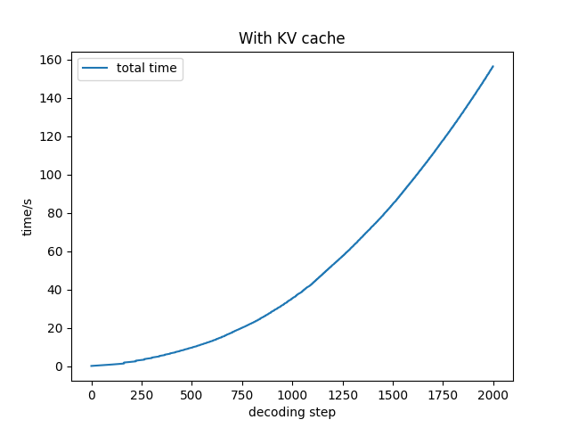
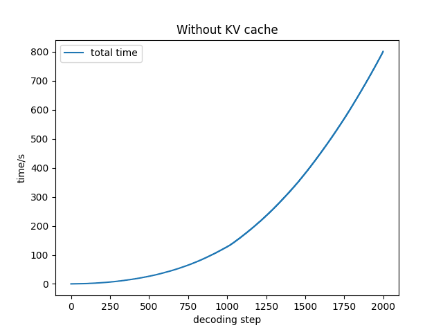

# GPT From Scratch

A minimal implementation of a GPT-style Transformer model with analysis of attention memory usage and inference optimization techniques.

This repository is built to understand the internal mechanisms of modern large language models (LLMs), including autograd engine, transformer architecture, autoregressive generation, KV cache acceleration, training loops, common training tricks, and the memory / IO characteristics of attention.

---

# Features

- Micrograd autograd engine (`scalargrad`) 
- Minimal GPT-style Transformer implementation in PyTorch (`model.py`) 
- Autoregressive text generation with KV cache (`infer.py`)
- Minimal training pipeline with modern optimization tricks (`train.py`)
- Memory analysis of attention mechanisms  
- Discussion of Flash Attention and IO complexity  

---

# Project Structure

- scalargrad
  - `micrograd.py` implement Value object with scalar version of autograd engine
  - `neuron.py` implement a Neuron Network with Value object
  - `test.py` check the backward result and train a simple Neuron Network
- `model.py` transformer architecture
- `infer.py` autoregressive generation, KV cache
- `train.py` training loop, gradient clipping, gradient accumulation, lr schedule, weight decay
- `config.py` GPT config, training config

# KV cache

Text generation is implemented in `infer.py`.
```text
Hello, I'm a language model, not a science. I'm a language designer. I want to write, I want to think. I want to create applications for people all over China
Hello, I'm a language model, I use an English sentence structure, I like words over sentences.

"That's OK I'll look up the way and that's exactly what
Hello, I'm a language model, not just another language." This isn't a "language model?" It's an idea. So far, what I have seen is there has been an
Hello, I'm a language model, not a programming model. I'm not a theoretical computer model - you read that right - because my ideas are still the core of my thinking about what
Hello, I'm a language model, I teach myself.

I want to know more about how languages work and why they could be used. Will you be able to put things like
```

During autoregressive generation, the model predicts one token at a time. Without optimization, attention computation repeatedly processes the entire prefix sequence.

KV cache stores previously computed Key and Value tensors so that each decoding step only processes the newly generated token.

This reduces compute complexity of generation from: $O(T^2) \to O(T)$ for each token generation step. 

The memory footprint of KV cache is $2\cdot B\cdot T\cdot C\cdot L\cdot$ dtype_size.

### Experiment

Experiments are conducted on an RTX 3090 GPU (24GB) with a maximum decoding length of 2000 tokens.

With KV cache, we use **B = 128**. The per-step complexity is $O(T)$ because attention is only computed between the new token and the cached keys/values. Therefore, the **total decoding time scales as $O(T^2)$**.

Without KV cache, the full attention matrix must be recomputed at every step. This leads to significantly higher memory usage, causing OOM for B = 128 due to the large attention weights. We therefore reduce the batch size to **B = 16**.

In this setting, the per-step complexity becomes **$O(T^2)$**, resulting in a **total decoding time close to $O(T^3)$**.

This experiment highlights the substantial efficiency gain brought by KV cache in autoregressive generation.
<table>
  <tr>
    <td></td>
    <td></td>
  </tr>
</table>

# Flash Attention and I/O Complexity

Standard self-attention is memory intensive because it explicitly materializes the full attention matrix:

\[
S = QK^T \in \mathbb{R}^{N \times N}
\]

For long sequences this results in **quadratic memory usage**, which quickly becomes the main bottleneck during training.

Flash Attention avoids constructing the full attention matrix by computing attention **block-wise**. Blocks of \(Q,K,V\) are loaded into on-chip SRAM, and the softmax normalization is computed **online**. This allows attention to be computed without storing the \(N\times N\) matrix in GPU memory.

Below is a simplified block implementation illustrating the core algorithm.

```python
# split Q,K,V
# Q,K,V shape : (N,d)
q = Q.split(Br,0)
k = K.split(Bc,0)
v = V.split(Bc,0)

O = [torch.zeros(Br,d)] * (N//Br)
m = [torch.tensor([[float('-inf')]]*Br)] * (N//Br)
l = [torch.zeros(Br,1)] * (N//Br)
for j in range(N//Bc):
    # load kj,vj
    for i in range(N//Br):
        #load qi
        sij = (q[i] @ k[j].T) /math.sqrt(d)# Br*Bc
        mij = torch.max(sij,1).values.unsqueeze(1)
        pij = torch.exp((sij-mij))
        lij = torch.sum(pij,1).unsqueeze(1)
        mi_new = torch.maximum(m[i],mij)
        li_new = torch.exp(m[i]-mi_new) * l[i] + torch.exp(mij-mi_new) * lij
        O[i] = 1/li_new * (torch.exp(m[i]-mi_new) * l[i] * O[i] + torch.exp(mij-mi_new) * (pij @ v[j]))
        m[i] = mi_new
        l[i] = li_new
O = torch.cat(O,0)
```


For each iteration j, the algorithm loads kj, vj, the scans the full Q, O. The resulting I/O complexity is 
\[
O(\dfrac{N}{B_c}(2B_cd + 2Nd)) = O(N^2d/B_c)
\]

Let the available SRAM size be M. Then
\[
B_c \sim O(M/d),\quad B_r\sim O(M/d),\quad B_r B_c\sim O(M)
\]

Substituting $B_c \sim O(M/d)$:
\[
O(N^2d/B_c)\sim O(N^2d^2/M)
\]

For GPT2-124M and RTX3090:
```text
head dimension d=64
SRAM size = 128KB
dtype = FP16
```

This yields
\[
d^2/M\sim 0.064
\]

While standard attention also relies on implicit tiling due to SRAM constraints, resulting in an I/O complexity $O(N^2d/B_c)$, its defining characteristic and primary bottleneck is the need to materialize the \(N\times N\) attention weight matrix. This leads to a memory complexity of $O(N^2)$, which in practice dominates the $O(N^2d^2/M)$ I/O cost of Flash Attention.

# Experiment
This section presents empirical measurements of memory usage and throughput under several commonly used optimization techniques.  
All experiments are conducted on **RTX3090 (24GB)** with the following configuration:
```text
B=8
T=1024
model GPT2-124M
```

### Performance Comparison
| mode |Peak meomry | tokens/sec|
|:------:|:------------:|:-----------:|
|FP32|16.65GB|15605|
|TF32|16.65GB|20526|
|BF16|15.64GB|27699|
|BF16+complie|11.95GB|46431|
|+flash attention|7.41GB|58612|
|+50257$\to$ 50304|6.66GB|60127|
### Memory Composition
GPU memory usage can be roughly divided into two components:
1. **Model state**: model weights, gradients, optimizer states. For GPT2-124M, this part occupies approximately 1.94GB.
2. **Forward activations**: intermediate tensors stored during the forward pass for backpropagation.
    The activation memory is approximately 9GB. Within these activations, the **attention weight matrix alone accounts for roughly 4.5GB**, making it one of the largest contributors to peak memory usage.

### Optimization Effects

The following observations summarize the impact of each optimization technique:

1. **TF32**

   TF32 accelerates tensor core matrix multiplications while still producing FP32 outputs. As a result, it improves compute throughput but does not reduce peak memory usage.

2. **BF16**
   BF16 reduces the storage cost of many intermediate activations during the forward pass. However, since model parameters and optimizer states are still maintained in FP32 for numerical stability, the overall memory reduction is moderate.

3. **`torch.compile`**
   `torch.compile` improves performance primarily in **memory-bound workloads** by:
   - fusing multiple operations into larger kernels  
   - reducing intermediate tensor materialization  
   - improving memory locality
  
   These changes reduce activation storage and significantly increase training throughput.

4. **Flash Attention**
   Flash Attention addresses the main bottleneck of standard attention: the storage of the **attention weight matrix**. By computing attention in blocks and performing softmax normalization online, it eliminates the need to materialize the full attention matrix (4.5GB) and improves throughput.

5. **Vocabulary Alignment**

   Changing the vocabulary size to even number will improve both memory efficiency and throughput. The value 50304 aligns better with tensor core tiling (multiple of 128), leading to more efficient matrix multiplications.

# References

- [Attention Is All You Need](https://arxiv.org/abs/1706.03762)
- [FlashAttention: Fast and Memory-Efficient Exact Attention with IO-Awareness](https://arxiv.org/abs/2205.14135)
- [nanoGPT](https://github.com/karpathy/nanoGPT)
- [micrograd](https://github.com/karpathy/micrograd)